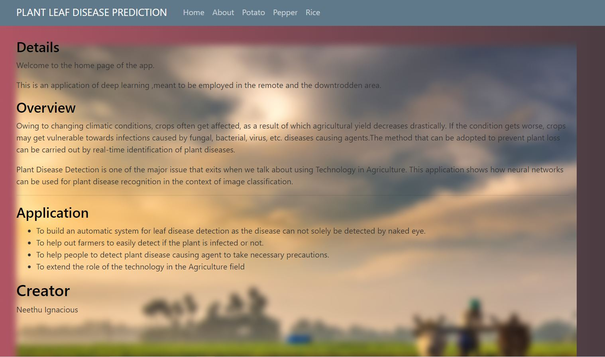

# Plant Leaf Disease Classification

Owing to changing climatic conditions, crops often get affected, because of which agricultural yield decreases drastically. If the condition gets worse, crops may get vulnerable towards infections caused by fungal, bacterial, virus, etc. diseases causing agents. The method that can be adopted to prevent plant loss can be carried out by real-time identification of plant diseases.

Plant Disease Detection is one of the major issues that exits when we talk about using Technology in Agriculture. This application shows how neural networks can be used for plant disease recognition in the context of image classification.

## Applications :

• To build an automatic system for leaf disease detection as the disease can not solely be detected by naked eye.

• To help farmers to easily detect if the plant is infected or not.

• To help people to detect plant disease causing agent to take necessary precautions.

• To extend the role of the technology in the agriculture field.

## Datasets:

The dataset is obtained from Kaggle.

link: https://www.kaggle.com/emmarex/plantdisease

link: https://www.kaggle.com/shayanriyaz/riceleafs

## Deployemnt :
The web app has been build using basic HTML, CSS, Javascript and Flask.

